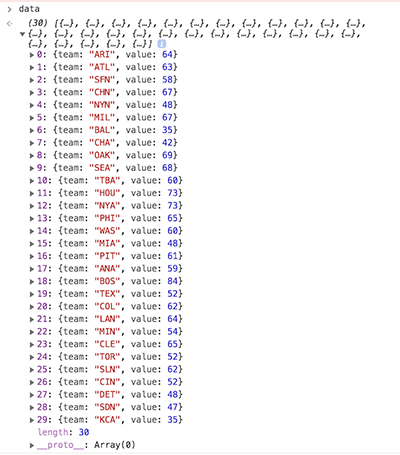
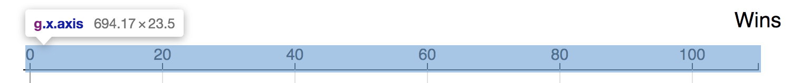
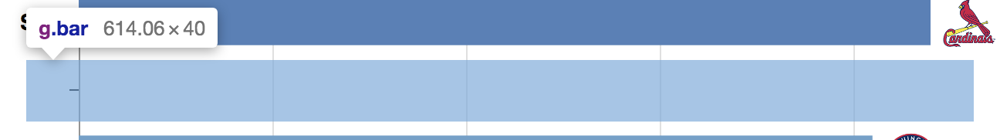
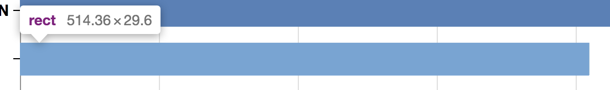
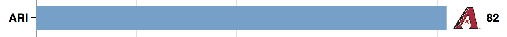
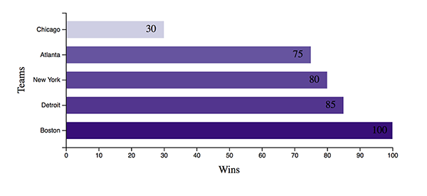
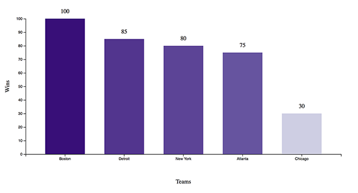
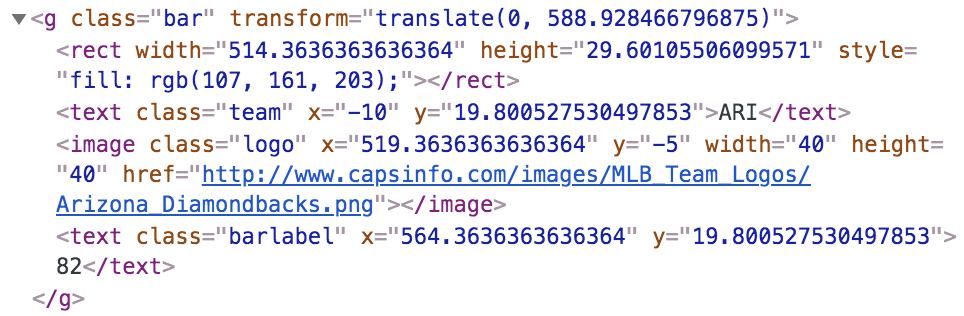
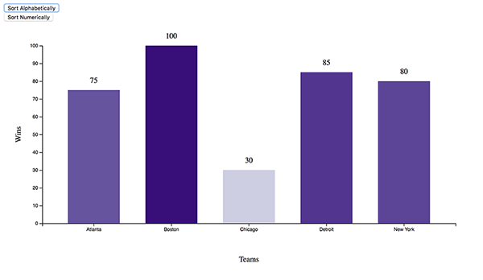
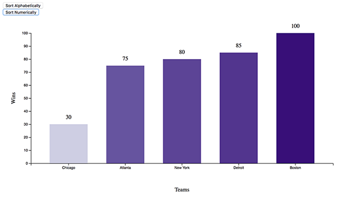

# D3.js Workshop <!-- omit in toc -->
- [Introduction to D3](#introduction-to-d3)
  - [Key Components](#key-components)
- [Getting Started](#getting-started)
- [Running D3 Locally](#running-d3-locally)
- [Getting D3](#getting-d3)
  - [D3 Version](#d3-version)
- [HTML Setup](#html-setup)
- [Graph Setup](#graph-setup)
- [Reading in Data](#reading-in-data)
- [Setting up D3 Scales](#setting-up-d3-scales)
- [Adding Axes](#adding-axes)
- [Individual Team Bar Charts](#individual-team-bar-charts)
- [Exercise #1 (Vertical Bar Chart)](#exercise-1-vertical-bar-chart)
- [Animating the Graph](#animating-the-graph)
- [Exercise #2 (Sort the Chart)](#exercise-2-sort-the-chart)
- [Exercise #3 (Animated Sort)](#exercise-3-animated-sort)
  - [Easing](#easing)
- [Clipped Path](#clipped-path)
- [References](#references)
## Introduction to D3
D3 (Data-Driven Documents or D3.js) is a JavaScript library for manipulating documents based on data and is used in conjunction with tools like HTML, SVG, and CSS. It's used by the [New York Times](https://getdolphins.com/blog/interactive-data-visualizations-new-york-times/) to make interactive custom graphics for its [news](https://www.nytimes.com/interactive/2019/11/06/us/politics/elizabeth-warren-policies-taxes.html) [articles](https://www.nytimes.com/interactive/2018/03/27/upshot/make-your-own-mobility-animation.html).

### Key Components
- HTML (HyperText Markup Language)
  - standard markup language for webpages
  - defines content
- CSS (Cascading Style Sheets)
  - language to describe the style of a HTML document
  - describes how HTML elements should be displayed
- JavaScript
  - scripting language for web pages 
  - lightweight, interpreted, or just-in-time compiled programming language
- SVG (Scalable Vector Graphics)
  - language for describing 2-D vector graphics in XML
- Web Server

## Getting Started
Download the files from the Github repo or the Box link provided in the workshop. The main files we will be working with are `index.html`, `sortable.js`, and `bar.css`. 

## Running D3 Locally
To run D3 locally on your PC, you need to set up a web server. Fortunately, Python makes this relatively easy. Open a terminal (i.e. Anaconda Prompt) that has access to Python and run a simple http server with the command `python -m http.server <port number>`. The port number is optional (default is 8000). Then open your browser and go to `localhost:8000` or `127.0.0.1:8000`. 

## Getting D3
We load the d3.js library from a CDN with the following snippet.
```html
<script src="https://d3js.org/d3.v5.min.js"></script>
```

We'll also use the **d3-array** library to do some data wrangling to get the data in the right format for plotting.
```html
<script src="https://d3js.org/d3-array.v2.min.js"></script>
```

### D3 Version
We're using D3 version 5. Most of the online v5 examples are written using something called [Observable notebooks](https://observablehq.com/) (think of it like Jupyter Notebooks for JavaScript). The syntax for Observable notebooks is slightly different than what you would use for HTML. Most of the other examples on the web are for v3 or v4. Ideally, you'll want to look for examples using v4 or v5 on the web. There were some breaking changes made in the conversion from v3 to v4. Its not impossible to figure out from v3 examples but its just more errors to debug.

## HTML Setup
Let's take a quick peek at our HTML file. Its pretty bare bones. The things to note are:
- loading two JavaScript files `urls.js` and `sortable.js`
- loading one CSS file `bar.css`
- one function call `createChart()` which will create our chart for us within the `<body>` tag
  
```html
<!DOCTYPE html>
<html lang="en">
<head>
  <meta charset="UTF-8">
  <script src="https://d3js.org/d3.v5.min.js"></script>
  <script src="https://d3js.org/d3-array.v2.min.js"></script>
  <script src="urls.js"></script>
  <script src="sortable.js"></script>
  <link rel="stylesheet" href="bar.css">
</head>
<body>
  <script>createChart()</script>
</body>
</html>
```
This is what you would see if you right-click *View page source <kbd>Ctrl+U</kbd>*. Note that this is different than what you would see if you inspected the Elements tab in Chrome using your browser.

## Graph Setup
Now, let's move onto our JavaScript file `sortable.js` and create the function `createChart` that we're going to call. We need to first set up our graph. We start by specifying the dimensions and margins of our graph. The standard D3 convention for setting up margins can be found at https://bl.ocks.org/mbostock/3019563 

Let us follow along with our code. 

First define the `margin` object with properties for the four sides:
```javascript
let margin = {top: 80, right: 90, bottom: 30+50, left: 120}
```

Next define `width` and `height`as the inner dimensions of the chart area: 
```javascript
width = 900 - margin.left - margin.right
height = 1500 - margin.top - margin.bottom
```

Lastly, define a `svg` element with three attributes (`class`, `width`, and `height`) and translate its origin to the top-left corner of the chart area with a `g` element.
```javascript
let svg = d3.select('body').append('svg')
    .attr("class", "chart")
    .attr("width", width + margin.left + margin.right)
    .attr("height", height + margin.top + margin.bottom)
  .append("g")
    .attr("transform", "translate(${margin.left},${margin.top})")
```
Let's breakdown what this D3 code block is doing.
- The first line selects the `<body>` tag in the HTML and appends (or nests) a `svg` element within the `<body>` element.
- The next three lines define attributes for the `svg` element.
- The second-to-last line appends a `g` element to `svg`.
- The last line applies a transformation (a translation) to the `g` element.

**Note**: There is a D3 distinction between a 2 space and 4 space indentation. Two space indentation means you are returning a new selection and 4 space indentation means working with an existing selection. Don't worry if that means nothing to you at the moment. Just know that its intentional.

## Reading in Data
We will be looking at data from Major League Baseball 2018 season and the accumulation of wins by each team as the season progresses.

The data resides in a Github gist. There is also a copy in our folder but I wanted to show you that you can also read files from the web.
```javascript
const fileLocation = 'https://gist.githubusercontent.com/caocscar/8cdb75721ea4f6c8a032a00ebc73516c/raw/854bbee2faffb4f6947b6b6c2424b18ca5a8970e/mlb2018.csv'
```

Next we will read the file, parse it, convert it into an array of objects (line 1) and filter it by date using our custom `filterData` function (lines 2 & 3). I chose April 4th as the start date as every team has won at least one game by then (helping avoid some other complications with adding teams dynamically).
```javascript
DATA = await d3.csv(fileLocation, type)
let chartDate = new Date(2018,3,3)
let data = filterData(chartDate)
```
**Note**: JavaScript starts month at index 0.

The function `type` takes in the data and parses the date strings into a JavaScript `Date` format. You can think of `d` as a row of the data.
```javascript
function type(d) {
  const formatDate = d3.timeParse('%Y%m%d')
  d.date = formatDate(d.date)
  return d
}
```
**Note**: `d3.csv` reads in all columns as strings and you usually convert them to numeric using a `type` function. There is a `d3.autoType` function which is also available to do automatic conversions.

The `filterData` function filters the data up to the given date. Here I'm using arrow `=>` functions for brevity. They are similar to `lambda` functions in Python.
```javascript
function filterData(chartDate) {
  const snapshot = DATA.filter(d => d.date <= chartDate)
  const wins = d3.rollup(snapshot, v => v.length, d => d.team) 
  return Array.from(wins, ([key, value]) => ({'team':key, 'value':value}))
}
```
The function does some data wrangling for us.
1. Filters the data by date  `DATA.filter(d => d.date <= chartDate)`.
2. Performs a groupby operation by team and counts how many times they appear (or win) in the data `d3.rollup(snapshot, v => v.length, d => d.team)`.
3. Returns the data in the desired format for us (an `Array` of JavaScript Objects) `Array.from(wins, ([key, value]) => ({'team':key, 'value':value}))`.

I could have done the data wrangling in another language like Python or R and created a different dataset to be read in but wanted to show you that D3 and JavaScript can also do similar things. Our data should look like this after being returned by `filterData`.


## Setting up D3 Scales
Since we are making a horizontal bar chart, we will utilize two scale functions: `scaleLinear` and `scaleBand`. `scaleLinear` creates a linear mapping while `scaleBand` is a mapping specific for bar charts. It will split the range into n (number of teams) bands and compute the positions and widths of the bands. 
```javascript
let y = d3.scaleBand()
    .domain(data.map(d => d.team).reverse())
    .range([height, 0])
    .padding(0.33)

let x = d3.scaleLinear()
    .domain([0, Math.ceil(d3.max(data, d => d.value)/5)*5])
    .range([0, width])
```
## Adding Axes
We define our axis properties. Here it's the scale we want to use `x`, orientation `axisTop()` and approximately how many ticks it should display `ticks(6)`. We append another group element to the already defined `svg` variable using `.append("g")`, assign two classes `x axis` and then call the axis generator `xAxis` to draw it with the specified arguments. Similarly for the y-axis.
```javascript
let xAxis = d3.axisTop(x)
    .ticks(6)

svg.append("g")
    .attr("class", "x axis")
    .call(xAxis);
    
let yAxis = d3.axisLeft(y)
    .tickFormat('')
    
svg.append("g")
    .attr("class", "y axis")
    .call(yAxis);
```


In addition to the axes, we want to add gridlines to the x-axis. Gridlines are coded very similarly to axes.
```javascript
let gridlines = d3.axisTop(x)
    .ticks(6)
    .tickSize(-height)
    .tickFormat("")

svg.append("g")			
    .attr("class", "grid")
    .call(gridlines)
```

Let's add axes labels now. 
```javascript
labels = svg.append('g')
    .attr('class', 'label')

labels.append('text')
    .attr('transform', `translate(${width},-40)`)
    .text('Wins')

ylabel = labels.append('text')
    .attr('transform', `translate(-80,${height/2} rotate(-90)`) 
    .text('Teams')
```

## Individual Team Bar Charts 
Next, we will start displaying our data on the graph. Ultimately, we want to show the progression of total games won for each baseball game over a period of time. Each team will be represented by a bar, text, logo and a label.

To set up the teams, we must first create groups to contain the collective information for each team. 

In D3, instead of telling D3 what to do, think of it as you are telling D3 what you want. The following piece of code constructs groups for each of the teams.
```javascript
let bar = svg.selectAll(".bar")
  .data(data)
  .join("g") // equivalent to .enter().append('g')
    .attr("class", "bar")
    .attr("transform", d => `translate(0,${y(d.team)})`)
```
Here's a breakdown of the above code block:
- `svg.selectAll(".bar)` says you want to select all element of type `class="bar"` (even if they don't exist at the beginning)
- `.data(data)` binds the data to this empty D3 selection
- `.join(g)` creates `g` elements for each row of data (i.e. team)

Then for each `g` element:
- `.attr('class', 'bar')` assigns `class="bar"`
- `.attr("transform", d => 'translate(0,${y(d.team)})')` assigns a transformation (x,y)


**Note**: Data joins in D3 are probably one of the more harder concepts to grasp. Here is Mike Bostock's blog on [joins](https://bost.ocks.org/mike/join/) and [selections](https://bost.ocks.org/mike/selection/).

Now we will add rectangles to each bar element and set the bar width corresponding to the wins for each respective team `.attr("width", d => x(d.value))`.
We style the bar using `.style('fill', d => d3.interpolateRdYlBu(d.value/100))` which defines the number of games won by each team as a fraction between 0 and 1. We will add a color scheme to visually encode the number of wins (the bars will gradually change from red to yellow to blue as teams win more games). Its really not needed for the graph but I wanted to show you how to do it.
```javascript
let rects = bar.append('rect')
    .attr("width", d => x(d.value))
    .attr("height", y.bandwidth())
    .style('fill', d => d3.interpolateRdYlBu(d.value/100))
```


More information on chromatic schemes can be found here: 
https://observablehq.com/@d3/color-schemes?collection=@d3/d3-scale-chromatic

Let's add labels to identify each team. 
```javascript
bar.append('text')
    .attr('class', 'team')
    .attr('x', -10)
    .attr('y', y.bandwidth()/2 + 5)
    .text(d => d.team)
```

As well as logos for each team. 
```javascript
const imgsize = 40
let imgs = bar.append("svg:image")
    .attr('class', 'logo')
    .attr('x', d => x(d.value) + 5)
    .attr('y', -5)
    .attr('width', imgsize)
    .attr('height', imgsize)
    .attr("xlink:href", d => `http://www.capsinfo.com/images/MLB_Team_Logos/${urls[d.team]}.png`)
```

And a label for the number of games the team has won.
```javascript
let barLabels = bar.append('text')
    .attr('class', 'barlabel')
    .attr('x', d => x(d.value) + 10 + imgsize)
    .attr('y', y.bandwidth()/2 + 5)
    .text(d => d.value)
```


And lastly, we add the date to display the time frame. 
```javascript
const formatDate = d3.timeFormat('%b %-d, %Y')
let dateLabel = labels.append('text')
    .attr('id', 'date')
    .attr('transform', `translate(0,-40)`)
    .text(formatDate(chartDate))
```

## Exercise #1 (Vertical Bar Chart)
Lets try to apply what we've learned so far with an exercise. 

Go into the `exercise_1` folder and open up `exercise_1.js`. Change the url to `localhost:8000/exercise_1`. You should see a horizontal bar chart. 


The goal of the exercise is to transform this horizontal bar chart into a vertical bar chart with the labels on the outside of the bars.


To approach this,  we can split it up into a couple steps: 
1. Switching from a bar chart horiziontal to vertical is essentially changing the scaling of the axes. Try using `scaleBand` for x and `scaleLinear` for y and change the `range` appropriately. 

2. We must switch the range of data in the `domain`. How should we do that?

3. We also have to consider how the rectangles were specified. What is the new `height` and `width`? What is the new `x` and `y`? 

4. Position the bar labels accordingly.

## Animating the Graph
Now that we have an idea of how the graph set up and plotting works, we will dive into animation. Going back to our inital example, the animation happens within HTML's `setInterval()` method.  The `setInterval()` method calls a function at specified intervals (in our case, `T`). Our function will perform one transition every interval.

For each transition, we need to do the following:
- update the date 
- re-construct a new dataset up to current date
- update the x-axis and gridlines
- update the bar chart
- sort the data and update the y-axis

Here we set up the period, `T`, and assign a variable name to our setInterval method. The first thing we do is increment the date by one day and then update the `dateLabel` variable with new text.
```javascript
const T = 300
let dailyUpdate = setInterval(function() {
  chartDate = d3.timeDay.offset(chartDate,1)
  dateLabel.text(formatDate(chartDate))
// ...    
}, T);
```

We need to update our dataset with our new date.
```javascript
data = filterData(chartDate)
```

We also need to update the graph's axes to make them responsive to the changing scores. We do this by updating the `x.domain` and then re-calling the `xAxis` and `gridlines` variables which are dependent on the variable `x`. 

For the x-axis, we are incrementing the scale by fives (arbitrary). D3 also has a `.nice()` method which you can add to let D3 choose a "nice" limit for you.
```javascript
x.domain([0, Math.ceil(d3.max(data, d => d.value)/5)*5]);
svg.select('.x.axis').transition().duration(T)
    .call(xAxis);
svg.select('.grid').transition().duration(T)
    .call(gridlines);
```

Here we update each team's bar graph. We attach our updated dataset to `rects`. We then re-specify the `width` attribute and `fill` style. If we did just this, this would actually give it the effect of stop-motion animation. We add the `.transition().duration(T)` part to smooth the transition. Similarly, we do the same for the logos and the bar labels. For the logos, we just need to update the `x` attribute and for the labels, we need to update the `x, y, text` attributes.
```javascript
rects.data(data)
  .transition().duration(T)
    .attr("width", d => x(d.value))
    .style('fill', d => d3.interpolateRdYlBu(d.value/100))

imgs.data(data)
  .transition().duration(T)
    .attr('x', d => x(d.value) + 5)

barLabels.data(data)
  .transition().duration(T)
    .attr('x', d => x(d.value) + 10 + imgsize)
    .attr('y', y.bandwidth()/2 + 5)
    .text(d => d.value)
```

For the y-axis, we need to update the `y.domain`. But we need to sort our new dataset first. We then update our `bar` variable by changing the `transform` attribute. 
```javascript
data.sort((a,b) => d3.descending(a.value,b.value));
y.domain(data.map(d => d.team).reverse());
bar.transition().duration(T)
    .attr("transform", d => `translate(0,${y(d.team)})`)
```
Recall that the `bar` variable points to a group of `g` elements where we have grouped a bunched of other elements together. This has the advantage of allowing us to make one call to move them all instead of multiple separate calls. These elements include the rectangle, team text, logo, and bar label. 


Lastly, we have to define an `if` statement to check if its the end of the season so we can stop the forever loop using `clearInterval()` to clear the timer we set earlier with `setInterval()`.
```javascript
if (chartDate > new Date(2018,9,1)) {
    clearInterval(dailyUpdate)
}
```

## Exercise #2 (Sort the Chart)
We will start with the solution from Exercise #1. 

Go into folder `exercise_2` and open up `index.html` and `exercise_2.js`. 

Our goal is to add sorting to our graph. We want to be able to sort alphabetically and numerically with a click of a button. 

Sort alphabetically: 


Sort numerically: 


We will need to update both the HTML as well as the JavaScript. Here are some hints.

Add this HTML snippet to the body of `index.html` to add two buttons 
```html
<div id="option1">
    <input name="alpabeticalButton" 
            type="button" 
            value="Sort Alphabetically" 
            onclick="updateAlpha()" />
</div>
<div id="option2">
    <input name="numericalButton" 
            type="button" 
            value="Sort Numerically" 
            onclick="updateNum()" />
</div>
```
*Hint*: Create the function `updateAlpha()`. The function should do 3 things:  
1. Sort the data. To do a sort with D3, you would write something like this `data.sort((a,b) => d3.ascending(a.COLUMN, b.COLUMN))`
where COLUMN is the name of your key or column
2. Define the new order of teams and call the axis generator again to update the graph's x-axis.
```javascript
// I've started the solution for you. 
// You just need to finish it (ellipses indicate where)
x.domain(...)
svg.select(".xaxis") ...
```
3. Reassign the values to update the height and the labels of the graph 
```javascript
bar.selectAll('rect') ...
bar.selectAll('.barlabel') ...
```
If you can get this, then adding the other sort option should be more straightforward. If you get this working, try changing the dataset to see if it still works.

## Exercise #3 (Animated Sort)
For our last exercise, we will animate the sorting in exercise #2. Recall, we just did some stop-motion animation in exercise #2 (albeit two frames).


Although this may sound hard, it is actually quite simple. All you have to do is add a `transition` to each moving part of the graph (rectangles, x-axis and bar labels) and define a time `duration` for the animation to occur.

### Easing
If you get the `transition` working, try adding an easing function (e.g. `.ease(d3.easeBounce)`) to the transition. Eased transitions control the motion of the elements during a transition. Here are some examples of how to use it (v4). https://bl.ocks.org/d3noob/1ea51d03775b9650e8dfd03474e202fe

## Clipped Path
Let's go over the code we've skipped so far.
```javascript
d3.select('.chart').append("defs")
  .append("clipPath")
    .attr("id", "clip")
  .append("rect")
    .attr('x', 0)
    .attr('y', 0)
    .attr("width", width + margin.left + margin.right)
    .attr("height", 0.4*height)
```

This piece of D3 code creates the following html code snippet.
```html
<defs>
  <clipPath id="clip">
    <rect x="0" y="0" width="900" height="536">
  </clipPath>
</defs>
```

If we inspect the `rect` element using inspector tool in the browser, we can see that it covers the top part of our bar chart. Its not currently drawn because of the `<defs>` tag which means that we just want to store the object and use it at a later time. Well now is the time. We can use this `rect` element to clip our chart to create a different effect. In our css file, we commented out one piece of code.
```css
.chart {
  clip-path: url(#clip); 
}
```

This css code block wants to clip the `chart` class with an element that has `id="clip"` (our `clipPath` SVG element). Let's uncomment it and run the code again. See how we are getting the effect of teams entering and leaving the chart from the bottom. Nothing about our base chart has changed. We are just using some visual trickery to create this effect.

## References
Mike Bostock's blog (creator of D3.js)  
https://bost.ocks.org/mike/

A beginner's tutorial to D3.js by Mike Bostock  
https://bost.ocks.org/mike/circles/

Gallery of D3.js examples  
https://bl.ocks.org/   

Another gallery of simple D3.js examples  
https://www.d3-graph-gallery.com/index.html

D3.js e-book to understand basics (they have books for v3, v4, and v5). It has line-by-line breakdown of code.
https://leanpub.com/d3-t-and-t-v5 

Alex's sandbox of D3.js examples  
https://github.com/caocscar/d3js-examples
