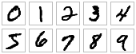

\titlepage
## Deep Neural Networks (DNNs)

-   A DNN is a mathematical function inspired by neural networks in the
    brain.

-   Input layer (features), hidden layers, output layer (targets).

-   Your data determines number of features and targets.

-   You choose number of hidden layers and "neurons" (activation units)
    in each hidden layer.

\centering
{width="50%"} 

## Deep Neural Networks (DNNs), cont'd

-   Hidden layers have variables (weights, biases) that are trained.

-   Mathematical structure: Composite of nonlinear activation functions
    acting on matrix/vector operations, e.g.
    $$f(x) = A_2{\color{red}g(A_1{\color{blue}g(A_0x+b_0)}+b_1)}+b_2$$

\centering
{width="\textwidth"} 

## Training DNNs

-   Training a DNN means optimizing the weights and biases to "fit"
    given data

    -   i.e. minimize error between DNN prediction and the given data

-   Optimization: Think of mountains and valleys. Your location is like
    the value of the weights/biases. Your elevation is like the value of
    the error. As you "walk down the mountain", you are changing the
    values of the weights/biases to decrease the value of the error.

\centering
{width="50%"}

## Training DNNs, cont'd

-   Usually a variant of **stochastic gradient descent**:

    -   **Gradient**: Points toward steepest slope

    -   **Gradient descent** method: Take steps down steepest slope to
        get to minimum

    -   **Stochastic gradient descent**: Calculate the error based on a
        small number of data (a **batch**) instead of the entire data
        set

-   You choose: step size (learning rate), batch size

\centering
{width="50%"}

## playground.tensorflow.org

\centering
{width="\textwidth"}

Note: playground.tensorflow.org is an educational tool. It does not
actually use the TensorFlow library, nor can you use it to train with
your data.

## Underfitting (high bias)

Symptoms:

-   High training and testing error

Possible treatments:

-   Make the model larger (more layers, more neurons)

-   Increase the number of features, artificially if necessary (e.g.
    $x_1x_2$, $\sin(x)$, etc.)

-   More training

\centering
{width="50%"}

\vspace{.5cm}
## Overfitting (high variance)

Symptoms:

-   Low training error, high testing error

-   (Made worse by noisy data)

Possible treatments:

-   More data

-   Regularization (L1, L2, dropout)

-   Less training (early stopping)

-   Simplify model (use w/ caution)

\centering
{width="50%"}

\vspace{.5cm}
## Regularization

-   Regularization smooths the model; reduces complexity in the output
    ([Wikipedia](https://en.wikipedia.org/wiki/Regularization_(mathematics))).

-   In neural networks, this is done by keeping the weights at a
    similar, low magnitude.

-   L1 regularization adds the L1 norm of the weights to the loss.

-   L2 regularization adds the L2 norm of the weights (more sensitive to
    outliers).

-   Dropout randomly and temporarily drops weights to zero during
    training.

\centering
{width="50%"}

## playground.tensorflow.org

\centering
{width="\textwidth"}

Note: playground.tensorflow.org is an educational tool. It does not
actually use the TensorFlow library, nor can you use it to train with
your data.

## Nonlinear regression

-   Begin with example of nonlinear regression.

-   Use a standard DNN to map continuous inputs to continuous outputs.

-   Data in example has two inputs, one output (slices parallel to
    x-axis are parabolic, slices parallel to y-axis are sinusoidal).

\centering
{width="50%"}

## Load data

## Build the model

Define the structure of the DNN. Here, we define two hidden layers, with
5 neurons in each layer.

We also specify the activation function here. The `relu` function is
commonly used, but you can use others (examples:
[Wikipedia](https://en.wikipedia.org/wiki/Activation_function)):

\vspace{.5cm}
\hspace*{10pt}
`sigmoid, softplus, tanh`, etc.

\vspace{.5cm}
Note that no activation is used on the final layer.

\vspace{.5cm}
Experiment with the hidden units and activation function.

## L1, L2 regularization

## Dropout

## Training

Stochastic gradient descent methods use shuffled mini-batches instead of
the entire data set for each training iteration. We specify batch size,
and how many epochs to train the code.

\vspace{.5cm}
An epoch is the number of training iterations required to go through the
entire training set once. For example, 1,000 datapoints and a batch size
of 10, one epoch would take 100 training iteration.

\vspace{.5cm}
We can also specify validation data to see how the validation loss
changes during training.

Experiment with batch size and number of epochs.

## Results

With good settings in the code (not the current settings), we can get
the following fit:

\centering
{width="80%"}

## Exercise 1

-   Run the code.

-   Identify the problem (underfitting or overfitting).

-   Try possible solutions to get a better fit.

## Classification

-   Consider the problem of classification.

-   Maps feature values to a category.

-   Use the example of irises

    -   Four features: sepal length, sepal width, petal length, petal
        width

    -   Three classes: Iris setosa, Iris virginica, Iris versicolor

\centering
](iris_versicolor.jpg){width="40%"}

## Import data

Data label format: Usually given as 0, 1, or 2; we need it to be [1,0,0], [0,1,0], or [0,0,1].

## Build the model

Define the structure of the DNN. Here, we define three hidden layers,
with 1000, 500, and 70 neurons in each respective layer.

Since this is classification, apply the
[softmax](https://en.wikipedia.org/wiki/Softmax_function) function to
the last layer. This transforms the output to be a vector of
probabilities that sum to one: $$\begin{aligned}
    p_i &= \frac{\exp(f_i)}{\sum\limits_j \exp(f_j)}\end{aligned}$$
where $p_i$ is probability of category $i$ being true, $f_i$ is $i$-th
component of the final layer's output.

## Loss

We again define the loss function and the optimizer. For classification,
we use the [cross entropy](https://en.wikipedia.org/wiki/Cross_entropy)
loss function. We are also interested in the accuracy metric (%
correctly classified), in addition to the loss.

$$\begin{aligned}
    \mathrm{cross\_entropy} = \frac{1}{n_\mathrm{samples}}\sum\limits_j^{n_\mathrm{samples}}\sum\limits_i^{n_\mathrm{classes}}\hat{p}_i^j\log(p_i^j)\end{aligned}$$
where $\hat{p}_i^j$ is the data and $p_i^j$ is the prediction for class
$i$, sample $j$.

## Training

Training is done as before.

## Exercise 2

-   Run the code.

-   Identify the problem (underfitting or overfitting).

-   Try possible solutions to get a better result.

## Convolutional Neural Network (CNN)

-   Image recognition is often done with CNNs.

-   CNNs perform classification by adding new types of layers, primarily
    "convolutions" and "pooling".

-   The "convolution": scanning a filter across the image.

-   The "pooling": take the most significant features from a group of
    pixels.

-   Some nice explanations of CNNs by [Adam
    Geitgey](https://medium.com/@ageitgey/machine-learning-is-fun-part-3-deep-learning-and-convolutional-neural-networks-f40359318721)
    and
    [ujjwalkarn](https://ujjwalkarn.me/2016/08/11/intuitive-explanation-convnets/).

-   Our example will use the [MNIST](http://yann.lecun.com/exdb/mnist/)
    database of handwritten digits.

-   Based on [this
    example](https://github.com/keras-team/keras/blob/master/examples/mnist_cnn.py).

    \centering
    {width="30%"}

## Initialize model, Normalize input

We shift and normalize the inputs for better fitting.

We also define the input shape. The images are 28 by 28 pixels, with a
grayscale value. This means each image is defined by a 3D tensor,
$28\times28\times1$ (a color image of the same size would be
$28\times28\times3$).

## Convolutional layer

The first convolutional layer is applied. This involves sweeping a
filter across the image. (Gives \"translational invariance.\")

We use 4 filters with a size of $5\times5$ pixels, with ReLU activation.

## Max pooling

Max pooling involves looking at clusters of the output (in this example,
$2\times2$ clusters), and sets the maximum filter value as the value for
the cluster.

I.e. a "match" anywhere in the cluster $\implies$ a "match" for the
cluster.

\vspace{0.5cm}
Since we are also using stride of 2, the clusters don't overlap.

Pooling reduces the size of the neural net, speeding up computations.

## 2nd convolution and pooling

A second convolutional layer, followed by max pooling, is used.

## Fully-connected layer

The 3D tensor is converted back to a 1D tensor to act as input for a
dense or fully-connected layer, the same type used with the previous
regression and classification examples.

## Dropout, Softmax

We add a dropout layer here. In this example, dropout happens at a rate
of 40% (i.e. 40% of weights are temporarily set to zero at each training
iteration).

As in the Iris classification problem, we finish with a dense layer and
softmax activation function to return probabilities for each category.

## Compile, Train

We compile and train as in the previous classification example:

## Exercise 3

-   Run the file.

-   Modify the CNN and training to see how high of a validation accuracy
    you can get.
