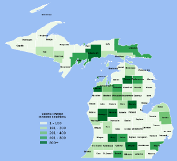

# Create Thematic Maps with Python

This 2 hr workshop demonstrates how to create thematic maps using Matplotlib.  
https://nbviewer.jupyter.org/github/caocscar/workshops/blob/master/thematic%20maps/Thematic%20Maps%20with%20Matplotlib.ipynb

Thematic Type|Image
:---:|---
Choropleth Map|
Dot Map|
Proportional Dot Map|
Isopleth|
